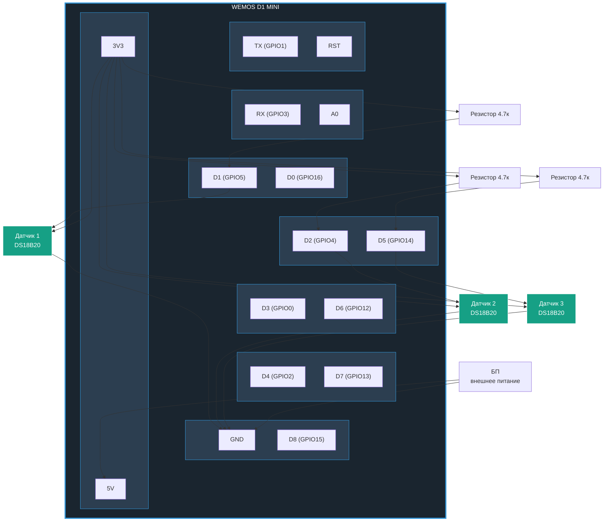

```mermaid
graph TD
    subgraph BOARD["WEMOS D1 MINI"]
        direction TB
        subgraph ROW1[" "]
            direction TB
            TX["TX (GPIO1)"]
            RST["RST"]
        end
        subgraph ROW2[" "]
            direction TB
            RX["RX (GPIO3)"]
            A0["A0"]
        end
        subgraph ROW3[" "]
            direction TB
            D1PIN["D1 (GPIO5)"]
            D0["D0 (GPIO16)"]
        end
        subgraph ROW4[" "]
            direction TB
            D2PIN["D2 (GPIO4)"]
            D5PIN["D5 (GPIO14)"]
        end
        subgraph ROW5[" "]
            direction TB
            D3["D3 (GPIO0)"]
            D6["D6 (GPIO12)"]
        end
        subgraph ROW6[" "]
            direction TB
            D4["D4 (GPIO2)"]
            D7["D7 (GPIO13)"]
        end
        subgraph ROW7[" "]
            direction TB
            GND["GND"]
            D8["D8 (GPIO15)"]
        end
        subgraph ROW8[" "]
            direction TB
            V5["5V"]
            V3["3V3"]
        end
        ROW1 ~~~ ROW2 ~~~ ROW3 ~~~ ROW4 ~~~ ROW5 ~~~ ROW6 ~~~ ROW7 ~~~ ROW8 
    end

    S1["Датчик 1<br>DS18B20"]
    S2["Датчик 2<br>DS18B20"]
    S3["Датчик 3<br>DS18B20"]

    R1["Резистор 4.7к"]
    R2["Резистор 4.7к"]
    R3["Резистор 4.7к"]

    TR1["БП<br>внешнее питание"]


    V3 --> S1
    V3 --> S2
    V3 --> S3
    S1 --> GND
    S2 --> GND
    S3 --> GND
    
    V3 --> R1 --> D1PIN --> S1
    V3 --> R2 --> D2PIN --> S2
    V3 --> R3 --> D5PIN --> S3

    TR1 --> GND
    TR1 --> V5


    classDef boardStyle fill:#1a252f,stroke:#3498db,stroke-width:3px,color:#ffffff
    classDef rowStyle fill:#2c3e50,stroke:#3498db,color:#ffffff
    classDef sensorStyle fill:#16a085,stroke:#fff,color:#fff

    class BOARD boardStyle
    class ROW1,ROW2,ROW3,ROW4,ROW5,ROW6,ROW7,ROW8 rowStyle
    class S1,S2,S3 sensorStyle

```
